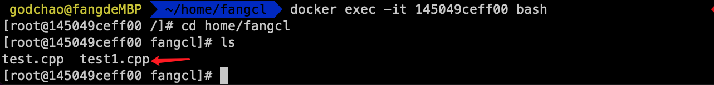
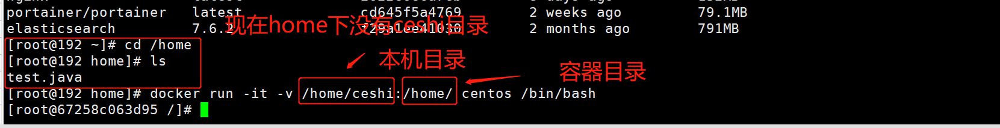
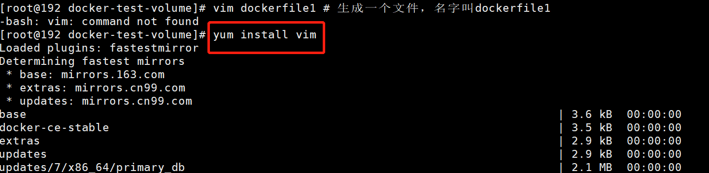
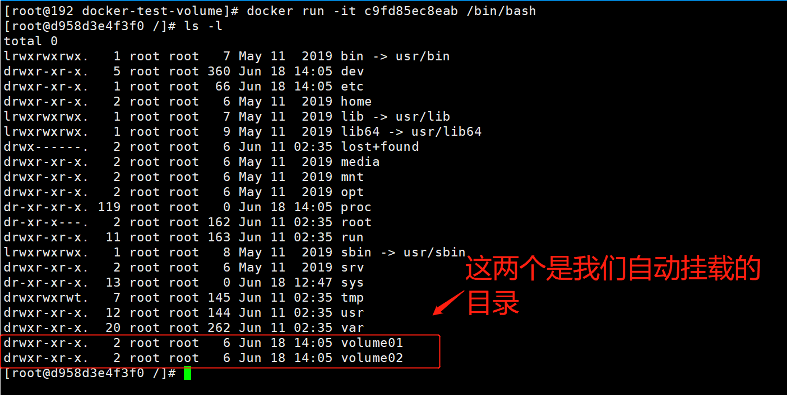
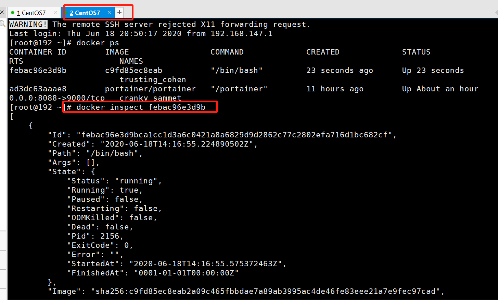
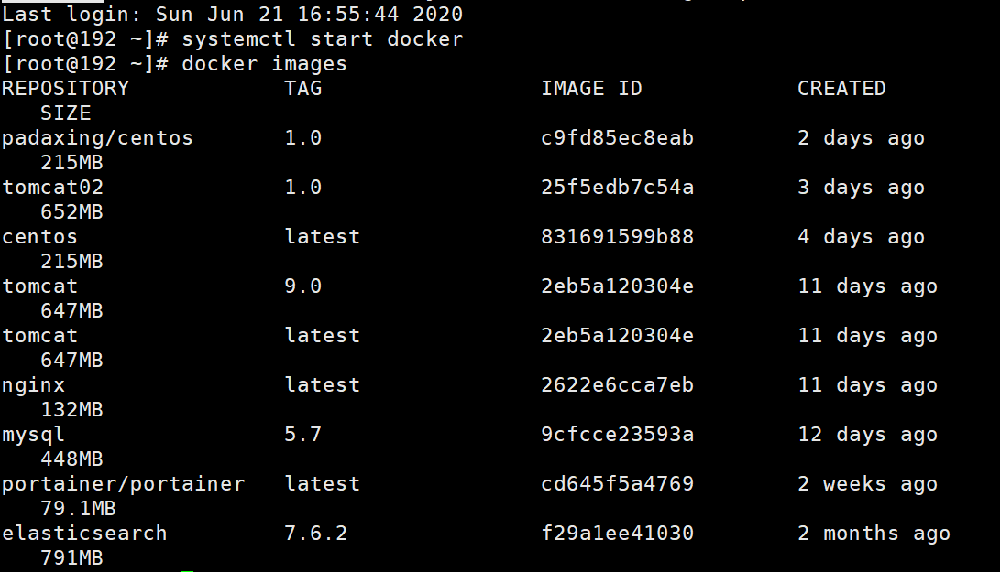
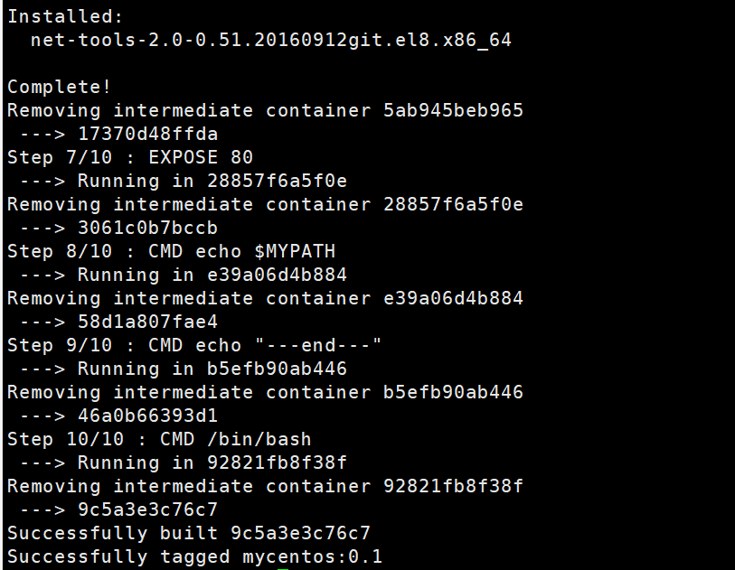
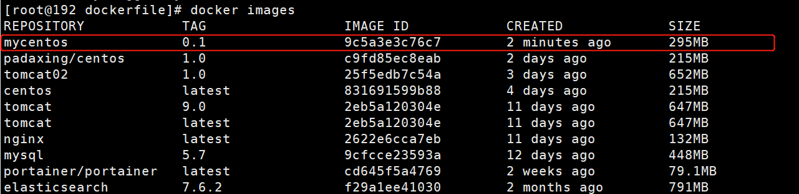

# Docker入门学习笔记

## 参考资料

官方文档：https://docs.docker.com/docker-for-linux

仓库地址：https://hub.docker.com

## Docker概述

### Docker为什么会出现

一款产品，开发和上线两套环境，应用环境配置费时费力，而且容易出问题，很可能存在版本问题、底层依赖冲突问题，所以发布项目时，不只是一套代码过去，而是代码+环境整体打包过去

所谓开发即运维，保证系统稳定性，提高部署效率

使用Docker后的流程：

开发：建立模型--环境--打包带上环境，即镜像--放到Docker仓库

部署：下载Docker中的镜像，直接运行就行


Docker的思想来自于集装箱，集装箱，对环境进行隔离

Docker通过隔离机制，可以将服务器利用到极致。

### 容器与虚拟机

在容器技术出来之前，用的是虚拟机技术

#### 虚拟机原理示意图

模拟具有完整硬件功能的、运行在一个完全隔离环境中的完整计算机系统


缺点：

1. 资源占用多
2. 冗余步骤多
3. 启动很慢

#### 容器化技术示意图

不是模拟的完整的操作系统


#### 二者对比

比较虚拟机和Docker的不同

|          | 传统虚拟机               | Docker        |
| -------- | ------------------------ | ------------- |
| 虚拟内容 | 硬件+完整的操作系统+软件 | APP+LIB       |
| 大小     | 笨重，通常几个G          | 轻便几个M或KB |
| 启动速度 | 慢，分钟级               | 快，秒级      |
|          |                          |               |

## Docker安装

### Docker的基本组成


明确三个概念：

1. 镜像(image)：docker镜像好比一个模板，可以通过这个模板来创建容器(container)，一个镜像可以创建多个容器，类似C++中的类

2. 容器(container)：类似C++中通过Class创建的实例对象，容器可以理解为一个简易版的系统

3. 仓库(repository)：存放镜像的地方，

   分为共有仓库和私有仓库

   - Docker Hub：

     

### 安装docker引擎

```shell
yum install docker-ce docker-ce-cli containerd.io # docker-ce 社区版 ee 企业版
```

### 启动Docker

```go
systemctl start docker # 代表启动成功
```

```go
docker version   #查看安装的版本
```


```go
docker run hello-world
```


中间一堆是签名信息

run的运行流程图


查看下载的镜像

```go
docker images
```


```go
# 各字段说明
REPOSITORY  # 镜像仓库源
TAG                 # 镜像的标签
IMAGE ID           # 镜像的ID
CREATED           # 镜像的创建时间
SIZE # 镜像的大小
```


### 卸载Docker

```go
# 卸载依赖
yum remove docker-ce docker-ce-cli containerd.io

# 删除资源
rm -rf /var/lib/docker # docker 的默认工作路径

```

## 底层原理

Docker是真么工作的？

Docker是一个Client-Server结构的系统，Docker的守护进程在主机上。通过Socket从客户端访问！

DockerServer接受到Docker-Client的指令，


Docker比虚拟机快的原因？

1. Docker有着比虚拟机更少的抽象层
2. docker主要用的是宿主机的内核，vm上有Guest OS


所以说新建一个容器的时候，docker不需要像虚拟机一样重新加载一个操作系统内核，避免引导


## Docker基本命令

### 帮助命令

```
docker version # 显示docker的基本信息
docker info # 系统信息，镜像和容器的数量
docker 命令 --help # 全部信息
```

[官网文档](https://docs.docker.com/reference/)


```bash
--all , -a		Show all images (default hides intermediate images) # 显示所有
--digests		Show digests
--filter , -f		Filter output based on conditions provided
--format		Pretty-print images using a Go template
--no-trunc		Don’t truncate output
--quiet , -q		Only show numeric IDs # 只显示id
```


#### docker search

搜索仓库中的镜像，相当于网页搜索

```go
docker search mysql
```


```go
docker search --help
```


```bash
# 解释
Options:
  -f, --filter filter   Filter output based on conditions provided
      --format string   Pretty-print search using a Go template
      --limit int       Max number of search results (default 25)
      --no-trunc        Don't truncate output

```

#### docker pull

下载镜像

```bash
docker pull mysql # 下载mysql镜像，default tag，默认最新版latest
```


```bash

docker pull mysql
# 等价于
docker pull docker.io/library/mysql:latest
# 指定版本下载 
docker pull mysql:5.7

```


版本来自于官网，版本库https://hub.docker.com/_/mysql


```go
docker images
```

此时查看镜像，可以看到新下载的两个


#### docker rmi

remove images

```bash
# 删除一个 可以通过名称 也可以指定id -f表示删除所有
docker rmi -f 9cfcce23593a
# 删除多个 用空格分隔id
docker rmi -f id id id
# 删除所有 
docker rmi -f $(docker images -aq) # images -aq就是查所有镜像id，从而递归删除
```

### 容器命令

有了镜像才能创建容器

#### 新建容器并启动

```shell
docker run [可选参数] image

# 参数说明
--name=“Name” # 容器名字，用于区分容器
-d 后台方式运行
-it 使用交互方式运行，进入容器查看内容
-p 指定容器的端口 如-p 8080::8080
	-p ip:主机端口：容器端口
	-p 主机端口:容器端口
	-p 容器端口
	
-p 随机指定端口
```

#### 进入退出容器

```bash
# 进入
docker run -it centos /bin/bash 
# 查看目录
ls
# 退出
exit
```


这里面主机名，变成了centos的id

#### 查看运行的容器

```go
# 查看正在运行的容器
docker ps
# 查看曾经运行的容器
docker ps -a
# 显示最近创建的容器，设置显示个数
docker ps -a - n=? 
# 只显示容器的编号
docker ps -aq
```


#### 退出容器

```shell
# docker run -it centos /bin/bash
# docker exec -it edbd9366d959 /bin/bash ## 再次进入
[root@edbd9366d959 /]# exit ##停止并推出  

```

#### 删除容器

```shell
# 删除指定容器 不能删除正在运行的容器，如果强制删除 rm -f
docker rm 容器id
# 删除所有容器
docker rm -f $(docker ps -aq)
# 删除所有容器
docker ps -a -q|xargs docker rm
```


#### 启动和停止容器的操作

```shell
docker start
docker restart
docker stop
docker kill
```


#### 后台启动docker

```shell
docker run -d 镜像名
# 用docker ps 查看的时候 发现停止了
# 后台运行，docker发现前台没有，容器启动后，发现自己没有提供服务，会立刻停止
```

#### 查看日志

```shell

docker logs -f -t --tail n 【id】

```


```shell
# docker logs --help

Usage:	docker logs [OPTIONS] CONTAINER

Fetch the logs of a container

Options:
      --details        Show extra details provided to logs
  -f, --follow         Follow log output
      --since string   Show logs since timestamp (e.g.
                       2013-01-02T13:23:37) or relative
                       (e.g. 42m for 42 minutes)
      --tail string    Number of lines to show from the
                       end of the logs (default "all")
  -t, --timestamps     Show timestamps # 时间戳
      --until string   Show logs before a timestamp (e.g.
                       2013-01-02T13:23:37) or relative
                       (e.g. 42m for 42 minutes)


```

```shell

# 运行centos里面加个脚本

```


查看日志发现每隔一秒打印一行

#### 查看正在运行的容器信息

```shell
# docker inspect 54002c5c42f2

```

```go
[
    {
         # 容器的完整id
        "Id": "54002c5c42f2c793adfc335409142cc620ede72e4016bb2294ff01bf62f343e3",
        "Created": "2022-04-23T14:53:04.167311546Z",
        # 脚本位置
        "Path": "/bin/sh",
        # 运行的脚本
        "Args": [
            "-c",
            "while true;do echo -----stert------;sleep 1;done"
        ],
        "State": {
            "Status": "running",   # 状态，正在运行
            "Running": true,
            "Paused": false,
            "Restarting": false,
            "OOMKilled": false,
            "Dead": false,
            "Pid": 3672,   # 父进程id
            "ExitCode": 0,
            "Error": "",
            "StartedAt": "2022-04-23T14:53:04.443132294Z",
            "FinishedAt": "0001-01-01T00:00:00Z"
        },
      
       # 来源镜像
        "Image": "sha256:5d0da3dc976460b72c77d94c8a1ad043720b0416bfc16c52c45d4847e53fadb6",
        "ResolvConfPath": "/var/lib/docker/containers/54002c5c42f2c793adfc335409142cc620ede72e4016bb2294ff01bf62f343e3/resolv.conf",
        "HostnamePath": "/var/lib/docker/containers/54002c5c42f2c793adfc335409142cc620ede72e4016bb2294ff01bf62f343e3/hostname",
        "HostsPath": "/var/lib/docker/containers/54002c5c42f2c793adfc335409142cc620ede72e4016bb2294ff01bf62f343e3/hosts",
        "LogPath": "/var/lib/docker/containers/54002c5c42f2c793adfc335409142cc620ede72e4016bb2294ff01bf62f343e3/54002c5c42f2c793adfc335409142cc620ede72e4016bb2294ff01bf62f343e3-json.log",
        "Name": "/interesting_kowalevski",
        "RestartCount": 0,
        "Driver": "overlay2",
        "Platform": "linux",
        "MountLabel": "",
        "ProcessLabel": "",
        "AppArmorProfile": "",
        "ExecIDs": null,
      # 主机配置
        "HostConfig": {
            "Binds": null,
            "ContainerIDFile": "",
            "LogConfig": {
                "Type": "json-file",
                "Config": {}
            },
            "NetworkMode": "default",
            "PortBindings": {},
            "RestartPolicy": {
                "Name": "no",
                "MaximumRetryCount": 0
            },
            "AutoRemove": false,
            "VolumeDriver": "",
            "VolumesFrom": null,
            "CapAdd": null,
            "CapDrop": null,
            "CgroupnsMode": "host",
            "Dns": [],
            "DnsOptions": [],
            "DnsSearch": [],
            "ExtraHosts": null,
            "GroupAdd": null,
            "IpcMode": "private",
            "Cgroup": "",
            "Links": null,
            "OomScoreAdj": 0,
            "PidMode": "",
            "Privileged": false,
            "PublishAllPorts": false,
            "ReadonlyRootfs": false,
            "SecurityOpt": null,
            "UTSMode": "",
            "UsernsMode": "",
            "ShmSize": 67108864,
            "Runtime": "runc",
            "ConsoleSize": [
                0,
                0
            ],
            "Isolation": "",
            "CpuShares": 0,
            "Memory": 0,
            "NanoCpus": 0,
            "CgroupParent": "",
            "BlkioWeight": 0,
            "BlkioWeightDevice": [],
            "BlkioDeviceReadBps": null,
            "BlkioDeviceWriteBps": null,
            "BlkioDeviceReadIOps": null,
            "BlkioDeviceWriteIOps": null,
            "CpuPeriod": 0,
            "CpuQuota": 0,
            "CpuRealtimePeriod": 0,
            "CpuRealtimeRuntime": 0,
            "CpusetCpus": "",
            "CpusetMems": "",
            "Devices": [],
            "DeviceCgroupRules": null,
            "DeviceRequests": null,
            "KernelMemory": 0,
            "KernelMemoryTCP": 0,
            "MemoryReservation": 0,
            "MemorySwap": 0,
            "MemorySwappiness": null,
            "OomKillDisable": false,
            "PidsLimit": null,
            "Ulimits": null,
            "CpuCount": 0,
            "CpuPercent": 0,
            "IOMaximumIOps": 0,
            "IOMaximumBandwidth": 0,
            "MaskedPaths": [
                "/proc/asound",
                "/proc/acpi",
                "/proc/kcore",
                "/proc/keys",
                "/proc/latency_stats",
                "/proc/timer_list",
                "/proc/timer_stats",
                "/proc/sched_debug",
                "/proc/scsi",
                "/sys/firmware"
            ],
            "ReadonlyPaths": [
                "/proc/bus",
                "/proc/fs",
                "/proc/irq",
                "/proc/sys",
                "/proc/sysrq-trigger"
            ]
        },
       # 其他配置
        "GraphDriver": {
            "Data": {
                "LowerDir": "/var/lib/docker/overlay2/e867dd001e36d4168ddd99f0ca751bf9434f099fff6ee73b7a0e61511d82ebb1-init/diff:/var/lib/docker/overlay2/923c5b26c432ec1dc572ea75ea3dbd72039cf75371b2e36608bc640dcd81cf34/diff",
                "MergedDir": "/var/lib/docker/overlay2/e867dd001e36d4168ddd99f0ca751bf9434f099fff6ee73b7a0e61511d82ebb1/merged",
                "UpperDir": "/var/lib/docker/overlay2/e867dd001e36d4168ddd99f0ca751bf9434f099fff6ee73b7a0e61511d82ebb1/diff",
                "WorkDir": "/var/lib/docker/overlay2/e867dd001e36d4168ddd99f0ca751bf9434f099fff6ee73b7a0e61511d82ebb1/work"
            },
            "Name": "overlay2"
        },
      #挂载
        "Mounts": [],
      #基本配置
        "Config": {
            "Hostname": "54002c5c42f2",
            "Domainname": "",
            "User": "",
            "AttachStdin": false,
            "AttachStdout": false,
            "AttachStderr": false,
            "Tty": false,
            "OpenStdin": false,
            "StdinOnce": false,
            "Env": [
                "PATH=/usr/local/sbin:/usr/local/bin:/usr/sbin:/usr/bin:/sbin:/bin" #基本环境变量
            ],
          #基本命令
            "Cmd": [
                "/bin/sh",
                "-c",
                "while true;do echo -----stert------;sleep 1;done"
            ],
            "Image": "centos",
            "Volumes": null,
            "WorkingDir": "",
            "Entrypoint": null,
            "OnBuild": null,
            "Labels": {
                "org.label-schema.build-date": "20210915",
                "org.label-schema.license": "GPLv2",
                "org.label-schema.name": "CentOS Base Image",
                "org.label-schema.schema-version": "1.0",
                "org.label-schema.vendor": "CentOS"
            }
        },
      # 网卡，比如现在用的是桥接的网卡
        "NetworkSettings": {
            "Bridge": "",
            "SandboxID": "5d92c11dff09d85f28045237081f95d7ec459b97c94e1325f97074ccdfe92c8c",
            "HairpinMode": false,
            "LinkLocalIPv6Address": "",
            "LinkLocalIPv6PrefixLen": 0,
            "Ports": {},
            "SandboxKey": "/var/run/docker/netns/5d92c11dff09",
            "SecondaryIPAddresses": null,
            "SecondaryIPv6Addresses": null,
            "EndpointID": "31a60de604c0e0764127199e38ac5ac833d78054675ac22bc012d095c91d55dd",
            "Gateway": "172.17.0.1",
            "GlobalIPv6Address": "",
            "GlobalIPv6PrefixLen": 0,
            "IPAddress": "172.17.0.6",
            "IPPrefixLen": 16,
            "IPv6Gateway": "",
            "MacAddress": "02:42:ac:11:00:06",
            "Networks": {
                "bridge": {
                    "IPAMConfig": null,
                    "Links": null,
                    "Aliases": null,
                    "NetworkID": "e1cdb5878aa5a7e7d26074bec736a2cbaf69a569297b1ac5098e4a4f06600177",
                    "EndpointID": "31a60de604c0e0764127199e38ac5ac833d78054675ac22bc012d095c91d55dd",
                    "Gateway": "172.17.0.1",
                    "IPAddress": "172.17.0.6",
                    "IPPrefixLen": 16,
                    "IPv6Gateway": "",
                    "GlobalIPv6Address": "",
                    "GlobalIPv6PrefixLen": 0,
                    "MacAddress": "02:42:ac:11:00:06",
                    "DriverOpts": null
                }
            }
        }
    }
]
```


```shell
# 停止打印的那个容器
[root@192 ~]# docker stop 54002c5c42f2
54002c5c42f2
```

#### 进入当前正在运行的容器

```shell
# 通常容器都是使用后台方式运行的

docker exec -it 容器id bashSHELL

# 测试
 godchao@fangdeMBP  ~/home/fangcl  docker ps                                                                   
CONTAINER ID   IMAGE                    COMMAND                  CREATED       STATUS          PORTS                               NAMES
145049ceff00   centos                   "bin/bash"               2 hours ago   Up 46 minutes                                       hardcore_chatterjee
4a24c2140abe   centos:latest            "/bin/bash"              4 weeks ago   Up 11 hours                                         nervous_fermat
0509aa19e50d   centos:latest            "/bin/bash"              4 weeks ago   Up 11 hours                                         pedantic_elbakyan
5f4ea936280e   docker/getting-started   "/docker-entrypoint.…"   4 weeks ago   Up 11 hours     0.0.0.0:80->80/tcp, :::80->80/tcp   reverent_montalcini
 godchao@fangdeMBP  ~/home/fangcl  docker exec -it 145049ceff00 bash                                            ✔  2686  23:20:32
# ls
bin  dev  etc  home  lib  lib64  lost+found  media  mnt  opt  proc  root  run  sbin  srv  sys  tmp  usr  var
# ps -ef
UID        PID  PPID  C STIME TTY          TIME CMD
root         1     0  0 14:34 pts/0    00:00:00 bin/bash
root        33     0  0 15:21 pts/1    00:00:00 bash
root        48    33  0 15:21 pts/1    00:00:00 ps -ef


# 方式二
# docker attach 145049ceff00


# 区别
# docker exec # 进入容器后开启一个新的终端，可以在里面操作(常用)
# docker attach 进入容器正在执行的终端，不会启动新的进程

```


#### 从容器内拷贝文件到主机上

```shell

# 进入正在运行的容器
# docker attach 0569081aa89c
# 进入容器home/fangcl目录
# cd /home/fangcl
# 在目录中创建cpp文件
# touch test.cpp
# 退出并停止容器
[root@0569081aa89c home]# exit
exit

# 查看现在运行的容器
 godchao@fangdeMBP  ~/home/fangcl  docker ps                                                                    ✔  2689  
CONTAINER ID   IMAGE                    COMMAND                  CREATED       STATUS        PORTS                               NAMES
4a24c2140abe   centos:latest            "/bin/bash"              4 weeks ago   Up 11 hours                                       nervous_fermat
0509aa19e50d   centos:latest            "/bin/bash"              4 weeks ago   Up 11 hours                                       pedantic_elbakyan
5f4ea936280e   docker/getting-started   "/docker-entrypoint.…"   4 weeks ago   Up 11 hours   0.0.0.0:80->80/tcp, :::80->80/tcp   reverent_montalcini

# 容器虽然被停止，但是数据都会保留
godchao@fangdeMBP  ~/home/fangcl  docker ps -a                                                                 ✔  2692  
CONTAINER ID   IMAGE                    COMMAND                  CREATED          STATUS                         PORTS                               NAMES
54002c5c42f2   centos                   "/bin/sh -c 'while t…"   44 minutes ago   Exited (137) 34 minutes ago                                        interesting_kowalevski
c2e82a2945c6   centos                   "/bin/bash"              58 minutes ago   Exited (0) 58 minutes ago                                          dreamy_buck
ab52869bc0b4   centos                   "bin/bash"               2 hours ago      Exited (0) About an hour ago                                       objective_haibt
2b72dad9cd51   mysql:5.7                "docker-entrypoint.s…"   2 hours ago      Exited (1) 2 hours ago                                             intelligent_yonath
145049ceff00   centos                   "bin/bash"               2 hours ago      Exited (0) 2 minutes ago                                           hardcore_chatterjee
374fbc4593de   hello-world              "/hello"                 3 hours ago      Exited (0) 3 hours ago                                             gallant_williamson
2e2a62741ff4   centos:latest            "/bin/bash"              14 hours ago     Exited (255) 11 hours ago                                          suspicious_euclid
f3ee15d5de71   centos                   "/bin/bash"              14 hours ago     Exited (0) About an hour ago                                       nervous_benz
4a24c2140abe   centos:latest            "/bin/bash"              4 weeks ago      Up 11 hours                                                        nervous_fermat
0509aa19e50d   centos:latest            "/bin/bash"              4 weeks ago      Up 11 hours                                                        pedantic_elbakyan
5f4ea936280e   docker/getting-started   "/docker-entrypoint.…"   4 weeks ago      Up 11 hours                    0.0.0.0:80->80/tcp, :::80->80/tcp   reverent_montalcini
# 容器数据拷贝到主机
# docker cp 145049ceff00:/home/fangcl/test.cpp /home/fangcl

# 拷贝是一个手动过程，我们使用 -v 卷的技术，可以实现自动同步 /home/fangcl /home/fangcl
```




#### 查看内容占用

```shell
docker stats

```


#### 小结


#### 练习

##### 部署Nginx

```shell
# 官网搜索nginx，可以看到帮助文档

# 下载镜像
# docker pull nginx
Using default tag: latest
latest: Pulling from library/nginx
8559a31e96f4: Pull complete 
8d69e59170f7: Pull complete 
3f9f1ec1d262: Pull complete 
d1f5ff4f210d: Pull complete 
1e22bfa8652e: Pull complete 
Digest: sha256:21f32f6c08406306d822a0e6e8b7dc81f53f336570e852e25fbe1e3e3d0d0133
Status: Downloaded newer image for nginx:latest
docker.io/library/nginx:latest

# 查看镜像
godchao@fangdeMBP  ~/home/fangcl  docker images                                              ✔  2729  00:22:31
REPOSITORY                                    TAG       IMAGE ID       CREATED        SIZE
nginx                                         latest    fa5269854a5e   3 days ago     142MB
mysql                                         5.7       82d2d47667cf   3 days ago     450MB
mysql                                         latest    f2ad9f23df82   3 days ago     521MB
registry.cn-hangzhou.aliyuncs.com/ossrs/srs   4         8692d6e8500e   5 weeks ago    262MB
registry.cn-hangzhou.aliyuncs.com/ossrs/srs   encoder   15db0256be3c   7 weeks ago    286MB
docker/getting-started                        latest    bd9a9f733898   2 months ago   28.8MB
hello-world                                   latest    feb5d9fea6a5   7 months ago   13.3kB
centos                                        latest    5d0da3dc9764   7 months ago   231MB
# 运行测试
# -d 后台运行，--name 命名，-p 暴露端口，3344服务器、宿主机的端口，容器内部端口
# docker run -d --name nginx01 -p:3344:80 nginx
38dbf7bdcaef232d269b7184d91e44e06087181b5ee929494e177ad526810fa8
# docker ps
CONTAINER ID        IMAGE               COMMAND                  CREATED             STATUS              PORTS                  NAMES
38dbf7bdcaef        nginx               "/docker-entrypoint.…"   7 seconds ago       Up 6 seconds        0.0.0.0:3344->80/tcp   nginx01

# 使用3344可以访问成功
# curl localhost:3344


```


```shell
# docker ps
CONTAINER ID        IMAGE               COMMAND                  CREATED             STATUS              PORTS                  NAMES
cf488418b1ec        nginx               "/docker-entrypoint.…"   21 minutes ago      Up 21 minutes       0.0.0.0:3344->80/tcp   nginx01

# 进入容器
# 

# 查一下nginx在哪
root@cf488418b1ec:/# whereis nginx
nginx: /usr/sbin/nginx /usr/lib/nginx /etc/nginx /usr/share/nginx

# 到这个目录
root@cf488418b1ec:/# cd /etc/nginx
root@38dbf7bdcaef:/etc/nginx# ls
conf.d		koi-utf  mime.types  nginx.conf   uwsgi_params
fastcgi_params	koi-win  modules     scgi_params  win-utf

# 退出
root@cf488418b1ec:/etc/nginx# exit
exit

# 停止
# docker stop cf488418b1ec
cf488418b1ec


```


再次刷新网页，服务关闭

思考问题：每次改动nginx配置文件，都需要进入容器内部，十分麻烦，要是可以在容器外部提供一个映射路径，达到在容器外修改文件名，容器内部就可以自动修改？-v 数据卷技术

## Docker镜像

### 原理

UnionFS 联合文件系统


bootfs：boot file system

rootfs：root file system


Docker镜像都是只读的，当容器启动时，一个新的可写层被加到镜像的顶部，这一层就是我们通常说的容器层，容器层之下的都叫镜像层


### commit提交镜像

```shell
docker commit # 提交容器成为一个新的副本
docker commit -m="提交的描述信息" -a="作者" 容器id 目标镜像名：[TAG]
```

```shell
docker images
docker run -it -p 8080:8080 tomcat
```

## 容器数据卷

### 什么是容器卷

docker是要将应用和环境打包成一个镜像

这样，数据就不应该在容器中，否则容器删除，数据就会丢失，这就是删库跑路

故容器之间要有一个数据共享技术

在Docker容器中产生的数据，同步到本地，这就是卷技术

本质上是一个目录挂载，将容器内的目录挂载到虚拟机上


目的：容器的持久化和同步操作

容器间可以数据共享

### 使用数据卷

方式一：直接使用命令来挂载

```shell
docker run -it -v -p
# -it 交互式进入
# -v volume卷技术
# -p 主机端口
```



新开一个窗口

```shell
docker inspect 容器id
```


找到挂载信息Mounts


测试


容器停止后，修改主机文件，再启动容器的时候，数据同样改变

双向同步

### 实战安装mysql

MySQL的数据持久化命令

```shell
docker search mysql

# 拉取
docker pull mysql:5.7

# 挂载
docker run -d -p 3310:3306 -v /home/mysql/conf:/etc/mysql/conf.d -v /home/mysql/data:/var/lib/mysql -e MYSQL_ROOT_PASSWORD=123456 --name mysql01 mysql5.7

-d 后台运行
-p 端口映射
-v 卷挂载
-e 环境配置 安装启动mysql需要配置密码
--name 容器名字

```


链接测试：打开SQLyog


点 测试链接


点 链接


### 具名和匿名挂载

【视频书签：https://www.bilibili.com/video/BV1og4y1q7M4?p=23，有点累了，跟不动了，这两天运动太少了，有点颓】


### 

DockerFile使用来构建docker镜像的文件


> kas:
> 没有安装吧？
>
> kas:
> 安装一下就可以了
>
> py9001021曾叙坚:
> centos 默认使用vi写内容，vim需要下载
>
> py9001021曾叙坚:
> 是的，需要下载vim才能使用
>
> YF:
> 配置可以改下，字体就很炫酷了
>
> 都建民:
> 用vi  试试
>
> 都建民:
> 你没有安装vim
>
> 都建民:
> yum install vim
>
> 都建民:
> 试试这个命令

```shell
yum install vim # 编辑文件的，没有装一下
```



安装完之后就可以运行这个命令了


```shell
# 镜像是一层一层的，脚本是一行一行的
# 指令都是大写的
# 这里的每个命令可以理解为镜像的一层

FROM centos

VOLUME ["volume01","volume02"] # 再创建镜像的时候就挂载出来

CMD echo "---end---"
CMD /bin/bash

```


想保存并退出

>Wesley.:
>shift  加  冒号


```shell
cat dockerfile1

docker build -f dockerfile1 -t padaxing/centos:1.0 .  # 最后的点很重要 镜像名不能有/
```


```shell
docker images
```


启动生成的镜像



在容器内部创建一个文件



查看Mounts，Source对应容器外目录，匿名挂载卷


测试一下，在container volume01下生成文件


在主机挂载路径下，也同样生成

### 多个容器数据共享

【视频书签：https://www.bilibili.com/video/BV1og4y1q7M4?p=25，周日下午，滨江，大雨，本来说这周六刷完的，发现周六啥也干不下去，除了吃就是睡，要么发呆研究小金库】


看一下有啥images



启动docker01，用之前建的padaxing/centos 1.0  镜像

```shell
docker run -it --name docker01 padaxing/centos:1.0 # 1.0必须写
```


当前这个ctrl+p+q不停止退出


依次启动docker02、docker03

```shell
docker run -it --name docker02 --volumes-from docker01 padaxing/centos:1.0
```

docker02继承docker01的volumes

可以验证，在docker01下加一个数据，在docker02下也会出现


创建docker03，同样继承docker01

```shell
docker run -it --name docker03 --volumes-from docker01 padaxing/centos:1.0
```


在docker03的volume01下建立文件，在docker01的volume01下同样也有

即通过--volumes-from 可以实现不同容器间的数据共享

删除docker01，数据还在

```shell
docker rm -f 
```


可以看到，删除docker01，进入docker02，数据依然在

结论：

容器之间配置信息的传递，数据卷容器的生命周期一直持续到没有容器使用位置

但是如果持久化到了本地，即使所有容器删除了，本地数据是不会删除的

------

## DockerFile

是用来构建docker镜像的文件，可以理解为命令参数脚本

构建步骤：

1. 编写一个dockerfile文件
2. docker build 构建成为一个镜像
3. docker run运行镜像
4. docker push 发布镜像（DockerHub、阿里云镜像仓库 私有/共有）

这个写一个项目时一样的

### 官方DockerFile示例

看一下官方的DockerFile


可以看到官方镜像都是基础包，很多功能没有，我们通常会自己搭建自己的镜像

官方既然可以制作镜像，我们亦可以

-----

### DockerFile基础知识

1. 每个指令都必须是大写字母
2. 按照从上到下顺序执行
3.  *#*表示注释
4. 每一个指令都会创建体检一个新的镜像层，并提交


docker是面向开发的，我们以后要发布项目，做镜像，就要编写dockerfile文件，这个文件十分简单！

Docker镜像逐渐成为企业的交付标准，必须掌握！

---

### DockerFile命令


### 

```shell
FROM # 基础镜像 比如centos
MAINTAINER # 镜像是谁写的 姓名+邮箱
RUN # 镜像构建时需要运行的命令
ADD # 添加，比如添加一个tomcat压缩包
WORKDIR # 镜像的工作目录
VOLUME # 挂载的目录
EXPOSE # 指定暴露端口，跟-p一个道理
RUN # 最终要运行的
CMD # 指定这个容器启动的时候要运行的命令，只有最后一个会生效，而且可被替代
ENTRYPOINT # 指定这个容器启动的时候要运行的命令，可以追加命令
ONBUILD # 当构建一个被继承Dockerfile 这个时候运行ONBUILD指定，触发指令
COPY # 将文件拷贝到镜像中
ENV # 构建的时候设置环境变量
```

### 实战构建自己的centos

Docker Hub中99%的镜像都是从FROM scratch开始的

添加centos7的压缩包

```shell
# 创建一个自己的centos

# 进入home目录
cd /home

# 创建一个目录，之后的东西都保存到这里
mkdir dockerfile
# 进入这个目录
cd dockerfile/
# 创建一个dockerfile，名字叫mydockerfile
vim mydockerfile-centos


```

xshell新开一个界面

```shell
# 官方默认centos
docker run -it centos
pwd # 官方默认有pwd命令
vim # 官方默认没有vim命令
ifconfig # 官方默认没有ifconfig命令
```


回到mydockerfile


```shell
# 下面给官方centos加上自定义的内容
FROM centos
MAINTAINER padaxing<010301200@hai.com>

ENV MYPATH /usr/local
WORKDIR $MYPATH

RUN yum -y install vim
RUN yum -y install net-tools

EXPOSE 80

CMD echo $MYPATH
CMD echo "---end---"
CMD /bin/bash
```


ESC, shif + : 输入wq保存并退出

如果写错了需要修改、

```shell
vim mydockerfile-centos
# 进入之后按i或者INSERT键即可修改
```


下面通过这个这个文件创建镜像

```shell
docker build -f dockerfile-centos -t mycentos:0.1 .
```


依次执行命令



最终返回Successfully表示成功



```shell
docker run -it mycentos:0.1 # 版本号必须写，不然他会去找最新的
pwd
vim
ifconfig
```


这时可以看到这些功能都有了

可以通过查看docker构建历史


可以看到当前这个镜像是怎么一步一步构建起来的

我们平时拿到一个镜像也可以通过这个方法研究一下他是怎么做的

### CMD与ENTRYPOINT

【视频书签，https://www.bilibili.com/video/BV1og4y1q7M4?p=29，雨终于停了，想去江边跑步】

```shell

FROM centos
CMD ["ls","-a"] # 启动centos展示目录
```


测试ENTRYPOINT


run的时候可以直接加命令


Docker中许多命令都十分相似，我们需要了解他们的区别，最好的方式就是这样对比测试

---

### 实战Tomcat镜像

【视频书签，https://www.bilibili.com/video/BV1og4y1q7M4?p=30，这节有点长，这个jar包是哪来的，晚上再搞，先去该模型比较急，还有10节课，这周争取都看完】

1. 准备镜像文件 tomcat压缩包
2. 

## IDEA整合Docker

## Docker 整合Docker

## Docker Compose

## Docker Swarm

## 各种bug

### Xshell链接失败


```bash
Connecting to 192.168.147.131:22...
Could not connect to '192.168.147.131' (port 22): Connection failed.

```


注：电脑休眠重启后，机子会断开，要重新在vmware里面输入ip addr 获得ip


修改xshell中的主机接口即可

